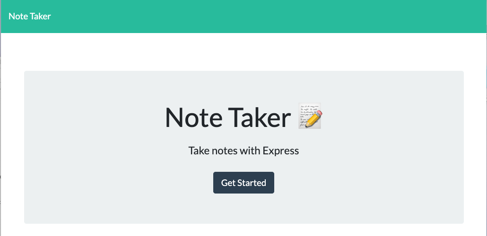
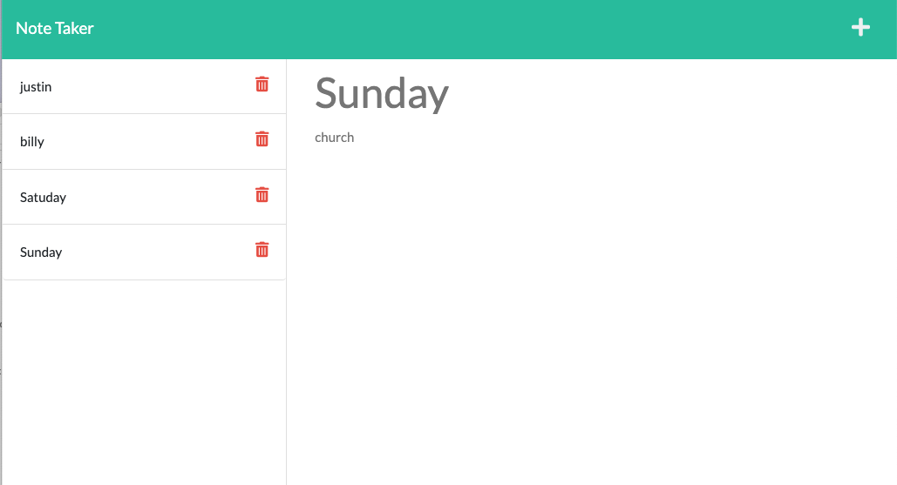

<h1>Note Taker👋</h1>
## Deploy the application to Heroku link: https://note-taken-express.herokuapp.com/notes

## Badges

 


## Description
🔍  A simple Express.JS based note app that able to take notes and save them and delete eisting notes. 
There are three main features of this application:
  1. When both title and text are entered, chlick the save icon to save the note to list.
  2. Click the red delete button in the list to delete the corresponding not from the list.
  3. Click the new entry button on top right corner to open a text area to create new note.


## Table of Contents
- [Description](#description)
- [Installation](#installation)
- [Usage](#usage)
- [Screenshot](#screenshot)
- [Contributing](#contributing)
- [License](#license)
- [Questions](#questions)


## Installation
💾 To install necessary dependencies, run the following command:
<br/>```
npm i express ```
<br/>


## screenshot




## Contributing
👥 Xiaojing Deng


## License

</br>
<p>Permission to use this application is granted under the MIT license.</p>
 
[MIT](https://choosealicense.com/licenses/mit)


## Questions
✋Reach me here:<br/>
:octocat: Find me on GitHub: [xiaojing168jmg168](https://github.com/xiaojing168jmg168)<br/>
📩 Email me with any questions: 8redfishcreative@gmail.com


